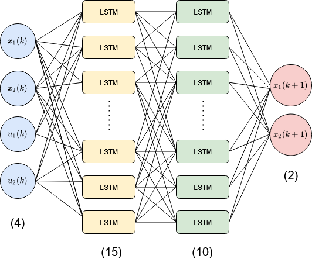

# LSTM for a Nonlinear dynamic system

I have been working with nonlinear dynamic systems for the entirety of my master's degree. For certain systems, it is simply impossible to account for all the factors and build a first-principles model, hence we rely on data-based models. Here, I used one such technique, particularly, using LSTM networks to model dynamic systems. I have provided a step by step walkthrough in my article [here](https://towardsdatascience.com/a-long-short-term-memory-network-to-model-nonlinear-dynamic-systems-72f703885818?sk=fdbfd6f0f23c8f695bd4980a0ed5f3ee).

